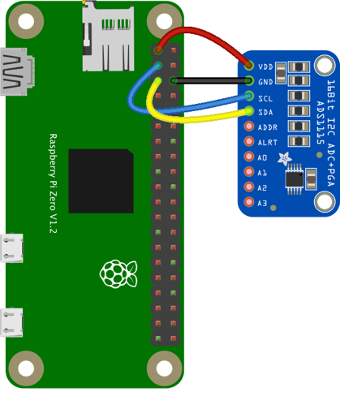

# ADS1x15 Examples

Examples using the Texas Instruments ADS1015 or ADS111d Analog-to-digital converters using the [node-ads1x15](https://github.com/alphacharlie/node-ads1x15) package.

These examples were tested using Adafruit's [ADS1015 breakout board](https://learn.adafruit.com/adafruit-4-channel-adc-breakouts?view=all). The wiring looks like this:

